# Shuldan Framework

[](https://github.com/shuldan/framework/actions)
[](https://codecov.io/gh/shuldan/framework)
[](https://goreportcard.com/report/github.com/shuldan/framework)
[](https://opensource.org/licenses/MIT)

**Shuldan Framework** — модульный, расширяемый Go-фреймворк для создания высоконагруженных серверных приложений.  
Он предоставляет готовые компоненты для HTTP, CLI, очередей, DI, логирования, событий и управления жизненным циклом.

---

## 🚀 Быстрый старт

```go
package main

import (
    "log"
	"github.com/shuldan/framework/pkg/bootstrap"
	"github.com/shuldan/framework/pkg/contracts"
)

func main() {
	boot := bootstrap.New("test", "dev", "TEST")
	boot.WithLogger()
	boot.WithHTTPServer()
	boot.WithCli()

	application, err := boot.CreateApp()
	if err != nil {
		log.Fatalf("Application initialization failed: %v", err)
	}

	if err := application.Run(); err != nil {
		log.Fatalf("Application run failed: %v", err)
	}
}
```

Запуск:
```bash
go run main.go http:serve
```

---

## 🧱 Архитектура

```mermaid
graph TD
    subgraph "Shuldan Framework Core"
        A[App] --> B[Registry]
        A --> C[Container DI]
        A --> D[AppContext]
    end

    subgraph "Модули приложения"
        B --> M1[CLI Module]
        B --> M2[Logger Module]
        B --> M3[Config Module]
        B --> M4[HTTP Module]
        B --> M5[Events Module]
        B --> M6[Queue Module]
        B --> M7[Database Module]
    end

    subgraph "DI Container"
        C --> F1[Factory]
        C --> F2[Instance]
        C --> F3[Resolve]
        F1 -->|depends on| C
        F2 -->|cached| C
    end

    subgraph "HTTP Module"
        M4 --> H1[HTTP Server]
        H1 --> H2[Router]
        H1 --> H3[Middlewares]
        H3 --> CORS[CORS]
        H3 --> LoggerMiddleware[Logger]
        H3 --> Recovery[Recovery]
        H1 --> H4[Context]
        H4 --> WebSockets[WebSockets]
        H4 --> Streaming[Streaming]
        H4 --> FileUpload[File Upload]
    end

    subgraph "Queue Module"
        M6 --> Q1[Producer]
        M6 --> Q2[Consumer]
        Q2 --> Q3[Redis Broker]
        Q2 --> Q4[Memory Broker]
        Q1 -->|Publish| Q3
        Q2 -->|Consume| Q3
        Q2 -->|Process| Handler[Job Handler]
    end

    subgraph "Events Module"
        M5 --> E1[Event Bus]
        E1 --> E2[Subscribe]
        E2 --> Listener[Listener Func]
        E1 --> E3[Publish]
        E3 --> E1
    end

    subgraph "Database Module"
        M7 --> R1[Repository]
        R1 --> R2[Transactional]
        R1 --> R3[Find Save Delete]
        M7 --> QBuilder[QueryBuilder]
        M7 --> Migration[Migration Runner]
        Migration --> SQL[SQL Dialect]
    end

    subgraph "Config Module"
        M3 --> L1[Config Loader]
        L1 --> JSON[JSON Loader]
        L1 --> YAML[YAML Loader]
        L1 --> ENV[Env Loader]
        L1 --> CLI[CLI Flags Loader]
        L1 --> Chain[ChainLoader]
    end

    subgraph "CLI Module"
        M1 --> C1[Command Registry]
        C1 --> CMD1[Command: serve]
        C1 --> CMD2[Command: migrate]
        C1 --> CMD3[Command: help]
        CMD3 --> Help[Auto-generated Help]
    end

    subgraph "Logger Module"
        M2 --> L[Logger]
        L --> Text[Text Handler]
        L --> JSON[JSON Handler]
        L --> Color[Color Output]
        L --> Context[With ...]
    end

    subgraph "Ошибки и утилиты"
        Err[Errors] --> Code[Error Codes]
        Err --> Detail[WithDetail ...]
        Err --> Cause[WithCause ...]
        Err --> Stack[Stack Trace]
        D[Traits] --> UUID[UUID ID]
        D --> IntID[Int64 ID]
        D --> StringID[String ID]
    end

    A -->|управляет| M1
    A -->|управляет| M2
    A -->|управляет| M3
    A -->|управляет| M4
    A -->|управляет| M5
    A -->|управляет| M6
    A -->|управляет| M7

    C -->|внедряет| M2
    C -->|внедряет| M3
    C -->|внедряет| M4
    C -->|внедряет| M5
    C -->|внедряет| M6
    C -->|внедряет| M7

    M3 -->|загружает| C
    M3 -->|настраивает| M2
    M3 -->|настраивает| M4
    M3 -->|настраивает| M6

    style A fill:#4C72B0,stroke:#333,color:white
    style B fill:#55A868,stroke:#333,color:white
    style C fill:#8C564B,stroke:#333,color:white
    style D fill:#D62728,stroke:#333,color:white
    classDef module fill:#1F77B4,stroke:#333,color:white;
    class M1,M2,M3,M4,M5,M6,M7 module
```



---

## 🔧 Основные компоненты

### 1. **App — Ядро приложения**

Управляет жизненным циклом: регистрация модулей, запуск, остановка, graceful shutdown.

#### 📌 Ключевые возможности:
- Регистрация модулей (`AppModule`)
- Гибкий таймаут graceful shutdown
- Интеграция с DI-контейнером
- Поддержка `context.AppContext`

#### 💡 Пример:
```go
application, _ := boot.CreateApp()
application.Register(NewMyModule())
application.Run()
```

---

### 2. **DI Container — Внедрение зависимостей**

Контейнер для управления зависимостями: регистрация фабрик, разрешение, кэширование.

#### 📌 Возможности:
- Поддержка `Factory`, `Instance`
- Защита от циклических зависимостей
- Lazy-инициализация
- Проверка на дубликаты

#### 💡 Пример:
```go
container := NewContainer()
container.Instance("logger", myLogger)
container.Factory("db", func(c DIContainer) (interface{}, error) {
    return NewDatabase(c.Resolve("config")), nil
})
```

---

### 3. **Logger — Структурированное логирование**

Интеграция с `log/slog`, цветной вывод, уровни, контекст.

#### 📌 Возможности:
- Поддержка `text` и `JSON` форматов
- Цвета в терминале
- Добавление контекста через `With(...)`
- Уровни: `DEBUG`, `INFO`, `WARN`, `ERROR`, `CRITICAL`

#### 💡 Пример:
```go
log := container.Get("logger").(logger.Logger)
log.Info("User logged in", "user_id", "123")
scopedLog := log.With("service", "auth")
scopedLog.Error("Auth failed", "error", err)
```

#### ⚙️ Конфигурация:
```yaml
logger:
  level: "error"
  format: "json"
  output: "stdout"
  base_dir: "./logs"
  file_path: "./app.log"
  enable_colors: false
  include_caller: false
```

---

### 4. **HTTP — Модуль HTTP-сервера**

Полноценный HTTP-сервер с поддержкой:
- REST, WebSockets
- Файловых загрузок
- Потоковой передачи
- Контекста запроса
- Обработки ошибок

#### 💡 Пример:
```go
ctx.Status(200).JSON(map[string]string{"message": "ok"})
ctx.FileUpload().FormFile("avatar")
ctx.Websocket().Upgrade()
ctx.Streaming().WriteStringChunk("Hello")
```

#### ⚙️ Конфигурация:
```yaml
http:
  server:
    address: "localhost:8080"
    shutdown_timeout: 30
    read_timeout: 5
    write_timeout: 10
    max_body_size: 4194304  # 4 MB
    middleware:
      security_headers:
        enabled: true
        csp: "default-src 'self'; script-src 'self' 'unsafe-inline';"
        x_frame_options: "DENY"
        x_xss_protection: "1; mode=block"
        referrer_policy: "strict-origin-when-cross-origin"
      hsts:
        enabled: true
        max_age: 31536000
        include_subdomains: true
        preload: true
      cors:
        enabled: true
        allow_origins:
          - "https://example.com"
          - "http://localhost:3000"
        allow_methods:
          - "GET"
          - "POST"
          - "PUT"
          - "DELETE"
          - "OPTIONS"
        allow_headers:
          - "Origin"
          - "Content-Type"
          - "Authorization"
        allow_credentials: true
        max_age: 86400
      logging:
        enabled: true
      error_handler:
        enabled: false
        show_stack_trace: false
        show_details: false
        log_level: "warn"
        status_codes:
          "ERR_VALIDATION": 400
          "ERR_AUTH": 401
          "ERR_FORBIDDEN": 403
          "ERR_NOT_FOUND": 404
          "ERR_INTERNAL": 500
          "ERR_TIMEOUT": 408
          "ERR_UNPROCESSABLE": 422
          "ERR_UNAVAILABLE": 503
        user_messages:
          "ERR_INTERNAL": "Internal server error. Please try again later."
          "ERR_TIMEOUT": "Request timed out. Please try again."
          "ERR_UNAVAILABLE": "Service temporarily unavailable."
          "ERR_VALIDATION": "One or more validation errors occurred."
          "ERR_AUTH": "Authentication required."
          "ERR_FORBIDDEN": "You don't have permission to access this resource."
          "ERR_NOT_FOUND": "The requested resource was not found."
          "ERR_UNPROCESSABLE": "The request was well-formed but was unable to be followed due to semantic errors."
  client:
    timeout: 30
    max_retries: 3
    retry_wait_min: 100
    retry_wait_max: 1000
    backoff_strategy: "exponential"
    disable_keep_alives: false
    max_idle_connections: 100
    idle_conn_timeout: 90
  websocket:
    enabled: false
    check_origin: true
    allowed_origins:
      - "https://example.com"
      - "http://localhost:3000"
    subprotocols:
      - "chat"
      - "echo"
    read_buffer_size: 4096
    write_buffer_size: 4096
    ping_interval: 60
    pong_timeout: 10
    max_message_size: 524288
    compression: false
  static:
    enabled: true
    mappings:
      - path: "/assets"
        root: "./public"
        index_file: "index.html"
        cache_control: "public, max-age=3600"
        browse: false
      - path: "/uploads"
        root: "./storage/uploads"
        cache_control: "private, max-age=0"
        browse: false
```

---

### 5. **Events — Событийная шина**

Публикация и подписка на события с поддержкой `context`.

#### 💡 Пример:
```go
bus.Publish(ctx, UserCreatedEvent{ID: "123"})
bus.Subscribe(ctx, func(ctx context.Context, e UserCreatedEvent) error {
    log.Info("User created", "id", e.ID)
    return nil
})
```


#### ⚙️ Конфигурация:
```yaml
events:
  async_mode: true
  worker_count: 5
```

---

### 6. **Queue — Очереди задач**

Фоновая обработка задач с поддержкой:
- Redis-брокера
- Retry, DLQ
- Автоматической регистрации обработчиков

#### 💡 Пример:
```go
type SendEmailJob struct {
    To      string `json:"to"`
    Subject string `json:"subject"`
}
queue.Produce(ctx, "emails", &SendEmailJob{To: "user@example.com", Subject: "Hello"})
```

---

### 7. **Database — Репозиторий и ORM**

Работа с базой данных через интерфейс репозитория.

#### 📌 Поддержка:
- CRUD операций
- Поиска, пагинации, счётчика
- Transactional репозитория
- UUID, IntID, StringID

#### 💡 Пример:
```go
user := TestUser{ID: NewUUID(), Name: "Alice"}
repo.Save(ctx, user)
found, err := repo.Find(ctx, user.ID)
```

#### ⚙️ Конфигурация:
```yaml
database:
  default: "primary"
  connections:
    primary:
      driver: "sqlite3"
      dsn: ":memory:"
      options:
        max_open_conns: 10
        max_idle_conns: 5
        conn_max_lifetime: 3600
        conn_max_idle_time: 1800
        ping_timeout: 15
        retry_attempts: 3
        retry_delay: 200
  migrations:
    enabled: true
    table: "schema_migrations"
    path: "./migrations"
  auto_migrate: true
```

---

### 8. **Errors — Расширенная система ошибок**

Гибкая система ошибок с:
- Уникальными кодами (например, `APP_0001`)
- Деталями, стек-трейсом, причинами
- Поддержкой `errors.Is`, `errors.As`
- Конкурентной безопасностью

#### 💡 Пример:
```go
var ErrValidation = errors.WithPrefix("AUTH").New("invalid credentials")
return ErrValidation.WithDetail("field", "email").WithCause(originalErr)
```

---

### 9. **CLI — Командная строка**

Регистрация и выполнение CLI-команд.

#### 💡 Пример:
```go
cmd := &testCommand{
    name:        "greet",
    description: "Say hello",
}
cli.Register(cmd)
cli.Run(appCtx)
```

---

### 10. **Config — Конфигурация**

Поддержка нескольких источников:
- Файлы: JSON, YAML
- Environment variables
- Флаги командной строки

---

## 🛠️ Инструменты

```bash
make deps       # Установка зависимостей
make fmt        # Форматирование кода
make lint       # Запуск линтеров
make vet        # Проверка go vet
make test       # Запуск тестов с race detector
make test-coverage  # С отчётом покрытия
make bench      # Бенчмарки
make ci         # Полная проверка (для CI)
make clean      # Очистка
```

---

## 📊 CI/CD

- GitHub Actions: запуск тестов, линтеров, security-сканирования (`gosec`)
- Codecov: отчёт о покрытии
- SARIF: интеграция с GitHub Security

---

## 🎯 Roadmap

- [ ] Поддержка GraphQL
- [ ] gRPC интеграция
- [ ] Distributed tracing (OpenTelemetry)
- [ ] Prometheus metrics
- [ ] Health checks
- [ ] Admin UI

---

## 🤝 Участие в разработке

1. Fork репозитория
2. Создайте feature branch (`git checkout -b feature/amazing-feature`)
3. Commit изменений (`git commit -m 'Add amazing feature'`)
4. Push в ветку (`git push origin feature/amazing-feature`)
5. Откройте Pull Request

### Требования к коду
- Покрытие тестами >80%
- Проходит все линтеры
- Соответствует Go conventions
- Документирован публичный API

---

## 📄 Лицензия

MIT License — подробности в файле [LICENSE](LICENSE).
